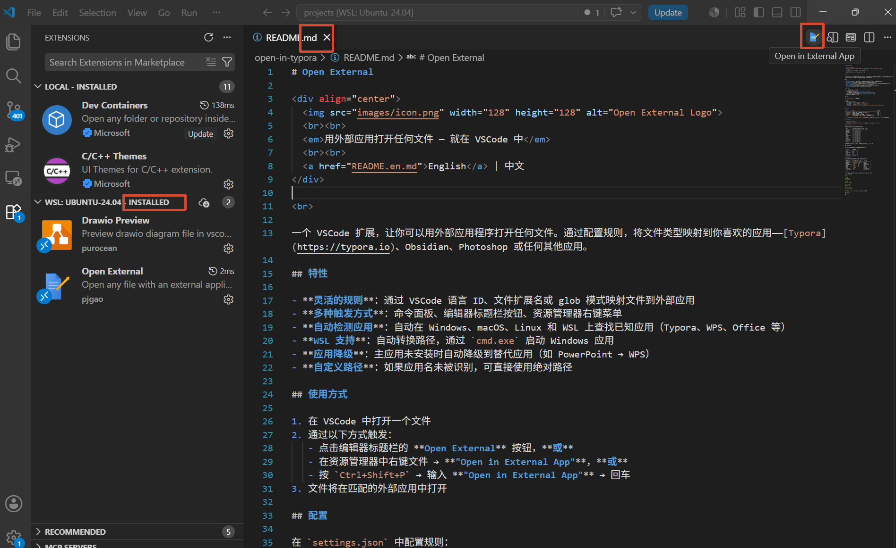

# Open External

<div align="center">
  
  <br><br>
  <em>Open any file with an external application — right from VSCode</em>
  <br><br>
  English | <a href="README.md">中文</a>
</div>

<br>

A VSCode extension that lets you open any file with an external application. Configure rules to map file types to your preferred apps — [Typora](https://typora.io), Obsidian, Photoshop, or anything else.

## Preview

<div align="center">
  
</div>

## Features

- **Flexible rules**: Map files by VSCode language ID, file extension, or glob pattern to any external app.
- **Multiple entry points**: Command Palette, editor title bar button, and explorer context menu.
- **Auto-detect apps**: Automatically finds known apps (Typora, Obsidian, MarkText) on Windows, macOS, Linux, and WSL.
- **WSL support**: Seamlessly converts paths and launches Windows apps via `cmd.exe`.
- **Fallback to path**: If an app name isn't recognized, use an absolute path as the `app` value.

## Usage

1. Open a file in VSCode.
2. Either:
   - Click the **Open External** button in the editor title bar, **or**
   - Right-click a file in the explorer → **"Open in External App"**, **or**
   - Press `Ctrl+Shift+P` → type **"Open in External App"** → press Enter.
3. The file opens in the matched external application.

## Configuration

Configure rules in `settings.json`:

```json
"openExternal.rules": [
  { "language": "markdown", "app": "Typora" },
  { "extension": ".psd", "app": "/usr/bin/gimp" },
  { "pattern": "*.design.ts", "app": "Figma" },
  { "language": "python", "app": "/Applications/PyCharm.app/Contents/MacOS/pycharm" }
]
```

### Rule properties

| Property     | Description                                         | Required |
|--------------|-----------------------------------------------------|----------|
| `language`   | VSCode language identifier (e.g. `markdown`)        | No*      |
| `extension`  | File extension (e.g. `.psd`)                        | No*      |
| `pattern`    | Glob pattern for filename matching (e.g. `*.design.ts`) | No*  |
| `app`        | App name (e.g. `Typora`) or absolute path to executable | Yes   |

\* At least one of `language`, `extension`, or `pattern` should be specified. Rules are matched in order; the first match wins.

### Other settings

| Setting | Description | Default |
|---------|-------------|---------|
| `openExternal.showEditorTitleButton` | Show the button in the editor title bar | `true` |

### Known app auto-detect

The following app names are automatically resolved to their default install paths:

| App          | Windows | macOS | Linux | WSL |
|--------------|---------|-------|-------|-----|
| Typora       | ✓ | ✓ | ✓ | ✓ |
| Obsidian     | ✓ | ✓ | ✓ | ✓ |
| MarkText     | ✓ | ✓ | ✓ | ✓ |
| WPS          | ✓ | ✓ | ✓ | ✓ |
| Word         | ✓ | ✓ | — | ✓ |
| PowerPoint   | ✓ | ✓ | — | ✓ |
| Excel        | ✓ | ✓ | — | ✓ |
| Drawio       | ✓ | ✓ | ✓ | ✓ |
| XMind        | ✓ | ✓ | ✓ | ✓ |
| Photoshop    | ✓ | ✓ | — | ✓ |
| Illustrator  | ✓ | ✓ | — | ✓ |
| VLC          | ✓ | ✓ | ✓ | ✓ |
| Preview      | — | ✓ | — | — |

For apps not in this list, use the absolute path to the executable as the `app` value.

### Default rules

The extension ships with these default rules (you can override or extend them in settings):

| File type        | Extension / Language | App          |
|------------------|----------------------|--------------|
| Markdown         | `language: markdown` | Typora       |
| Draw.io          | `.drawio`, `.dio`    | Drawio       |
| PowerPoint       | `.pptx`, `.ppt`      | PowerPoint   |
| Word             | `.docx`, `.doc`      | Word         |
| Excel            | `.xlsx`, `.xls`      | Excel        |
| XMind            | `.xmind`             | XMind        |
| Photoshop        | `.psd`               | Photoshop    |
| Illustrator      | `.ai`                | Illustrator  |

## Limitations

- Remote containers and SSH sessions are **not supported** (external apps are local GUI applications).
- WSL is fully supported.

## Development

```bash
# Install dependencies
npm install

# Compile
npm run compile

# Watch for changes
npm run watch

# Package as VSIX
npx vsce package
```

Press `F5` in VSCode to launch the Extension Development Host for testing.

## License

MIT
